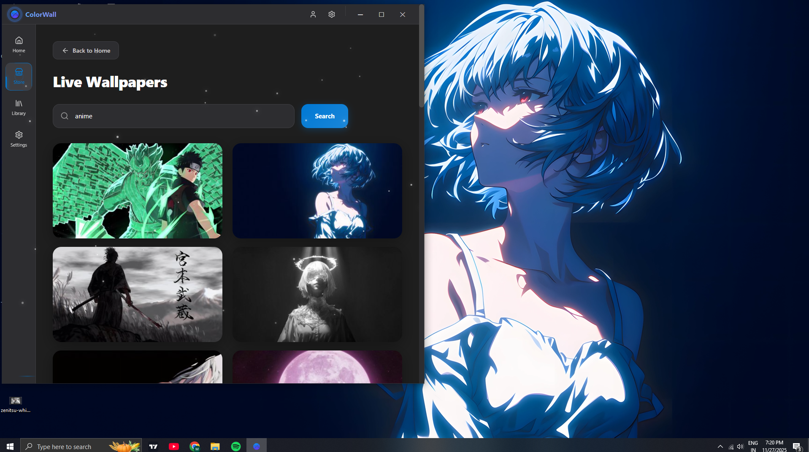

<div align="center">

# ColorWall

### Free Wallpaper Engine Alternative Built in Rust for Performance for gamers and optimization Conessiours
> Supporting -> LINUX | Windows | Mac
> Contributions are heavily welcome! Im open to learning the mistakes i might have made, im not the best at rust or ts

> **~0.5% CPU / Around 3-8%GPU usage AX • 4K Video Wallpapers • 6+ Auto-Scraped Sources**

> Zero Infrastructure needed- Just the app and your pc becomes the host

- Works offline

[](https://github.com/shelleyloosespatience/WallpaperEngine/actions/workflows/build.yml)
[](https://www.rust-lang.org)
[](https://tauri.app)

[Download](#-installation) • [✨ Features](#-features) • [Screenshots](#-screenshots) • [Build](#-build-from-source)



</div>

---

## 🚀 Why ColorWall?
> **Wallpaper Engine** costs $4 and locks you into Steam Workshop which is also paid sometimes
> **Lively Wallpaper** is free but uses 6x more GPU  
> **ColorWall** is free, faster, and scrapes All kind of ART/Wallpapers automatically, so no overhead needed from user

### Performance Benchmark on my old laptop at one time snapshot

| App | CPU Usage | GPU Usage | Memory | Price |
|-----|-----------|-----------|--------|-------|
| **ColorWall** | **0.7%** | 11.5% | 316 MB | **Free** |
| Lively Wallpaper | 1.9% | 74% | 294 MB | Free |
| Wallpaper Engine | 0.9% | 61.8% | 322 MB | $4 |

<sup>*Tested on Intel i3 integrated graphics laptop - if it works there, it'll on your PC*</sup>

---

## ✨ Features

### Live Video Wallpapers
- **4K 60fps** video wallpapers at **~0.5% CPU / ~1-2% GPU** (depends on hardware)
- Uses Windows Media Foundation (We use Windows Media Foundation by default for native decode and quick sync for performance, instead of using better video encoders like mpv :c)
- Smooth playback even on potato PCs
- Free and open store for setting wallpapers without a hassle.
### 🔍 Auto-Scraping from 6+ Sources
No manual downloads. Search once, get results FROM our Store, Just a search away/

### Three-Tier Smart Loading- Keeping in mind for perfomance and metered connections
1. **Thumbnails** load instantly (4-5 MB for 100 wallpapers)
2. **720p previews** on click (1-3 MB, instant playback)
3. **4K download** only when you confirm (gets cached)

**Result:** 95% less bandwidth than traditional wallpaper apps

---

#  Installation ✨✨✨

### Download for Your Platform From Releases at the side!
## Other ones coming soon ;c even android will be there when i get the time to do it
<div align="center">

| Platform | Download |
|----------|----------|
| 🪟 **Windows** | [ColorWall-Setup.exe](https://github.com/shelleyloosespatience/WallpaperEngine/releases/latest) |
| **Linux** | [ColorWall.AppImage](https://github.com/shelleyloosespatience/WallpaperEngine/releases/latest) |
| **macOS** | [ColorWall.dmg](https://github.com/shelleyloosespatience/WallpaperEngine/releases/latest) |

[📦 View All Releases](https://github.com/shelleyloosespatience/WallpaperEngine/releases)

</div>

> **Windows SmartScreen Warning?**  
> Click "More info" → "Run anyway"  
> *App isn't code-signed because certificates cost hundreds of dollars. It's open source!*

> Not that the opinion of windows defender matters, thats dogshit anyways, doesn't even help with real malwares lmao
---

## Preview Screenshots!

<div align="center">

### Main Gallery - Search & Filter


### Filter by Tags (No feet allowed lmao)


### Live Preview Modal with Video Player


</div>

## 🔨 Build from Source

Only if you don't trust the releases or want to contribute:
```bash
# Clone repo
git clone https://github.com/shelleyloosespatience/WallpaperEngine.git
cd WallpaperEngine

# Install dependencies
pnpm install

# Run in development
pnpm tauri dev

# Build for production
pnpm tauri build
```

> **Requirements:** Windows/Linux/macOS, Node.js 18+, pnpm, Rust 1.70+

---

## Contributing

Welcome! Ideas:

- [ ] Suggest more sources
- [ ] Favorites/collections/Upload system
- [Done] System tray icon
- [ ] Auto-change wallpaper on timer
- [ ] Fix Niche or bugs or Suggest improvements PLS
- [ ] Linux Wayland additional support
- [ ] Mobile (Android via Tauri Mobile)
- Or just sponsor this project, you will be the coolest cutie in the world

- See [Issues](https://github.com/shelleyloosespatience/WallpaperEngine/issues) for more!!


## Platform Support

| Platform | Status |
|----------|--------|
| **Windows 10/11** | Fully supported |
| **Linux (X11)** | Coming soon |
| **Linux (Wayland, KDE)** | Mostly works |
| **macOS** | Yet to test |
| **Android** | Planned |
| **iOS** | Unlikely |

---


## 💖 Support This Project

If this saved you $4 and your GPU:

- ⭐ **Star the repo** (it matters!)
- Report bugs (very important bruh)
- Suggest features
- [Sponsor](https://github.com/sponsors/shelleyloosespatience) (helps fund Android/iOS ports)

---

<div align="center">

**Built with ❤️ by [@me_straight](https://github.com/shelleyloosespatience)**

[Laxenta Inc](https://laxenta.tech) • [Website](https://laxenta.tech) • [Issues](https://github.com/shelleyloosespatience/WallpaperEngine/issues)

*Made because a Wallpaper Engine doesn't need to cost that much MONEY and have so many random purchases or use tons of CPU/GPU*

</div>


