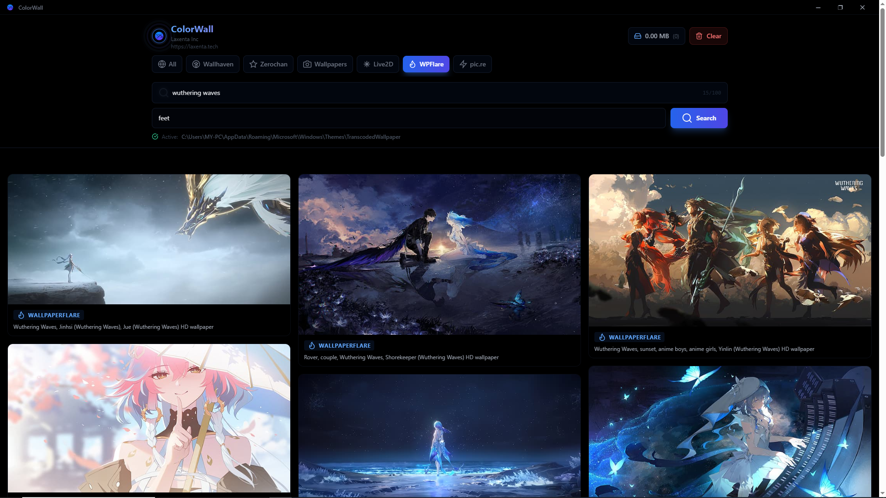
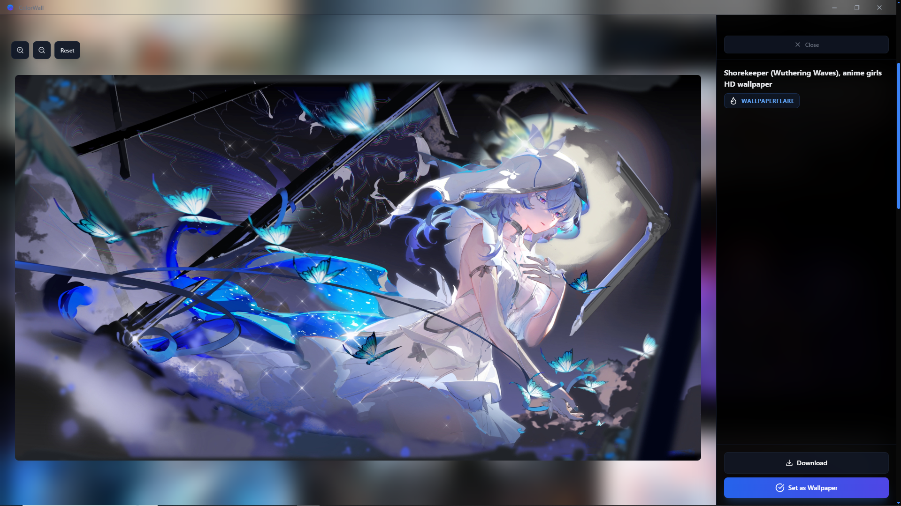

## ColorWall - A Live Wallpaper APP in rust with AutoScraping & Free everything
## Build for fun, but yes it does exactly what it should
## Unlimited wallpaper content directly from the FREE store, Native performance, **~3-5% GPU usage**, SO you can Play Games and use PC with Live Wallpapers running **Without** worrying about Performance

### - ColorWall -| Linux | Windows | Mac

**A extremely fast, optimized (~5% Gpu, 0.5ish CPU usage benchmarks) and free Wallpaper Engine, with native performance**
**built with Rust + Tauri for quick scraping and setting a cool new wallpaper for your cute device**

[Features](#-features) • [Installation](#-installation) • [Screenshots](#-screenshots) • [Development](#-development) • [Contributing](#-contributing)

---
## Performance

ColorWall vs alternatives (playing 4K video wallpaper):
| App | CPU | GPU | RAM |
|-----|-----|-----|-----|
| **ColorWall** | 0.3% | 35% | 316 MB |
| Lively Wallpaper | 1.9% | 74% | 274 MB |

*Tested on Intel i3 with integrated graphics laptop lmao lowkey*
---

## CRITICAL- Windows SmartScreen Warning
### THIS IS OPENSOURCE SOFTWARE AND CODE, IF YOU THINK ANYTHING IS bad-> JUST CHECK THE CODE SIMPLY IN main.rs (the whole scraping code exists there, or show an ai that file)
### OR just install the code, and build the executable yourself using pnpm i && pnpm run build, just for your happiness lmao cz u are a broke boi, no way i want anything from you
When you first run ColorWall, Windows may show a SmartScreen warning because the app is not code-signed, simple (certificates cost $$$ :c).

## To install:
1. Click "More info"
2. Click "Run anyway"
win antivirus is already shit anyways not that its opinion matters ._.
---

## ShowCase : )

### Main Interface

### Search & Filter

### Image Preview Modal

## ✨ Features~
- **Insanely Fast** - Three-tier loading (thumbnails → preview → 4K on demand) Rust + WMF native OS performance
- **Multi-Source Search** - Search across 6+ wallpaper providers simultaneously
  - Wallhaven
  - Zerochan
  - Wallpapers.com
  - Live2D (Moewalls)
  - WallpaperFlare (best source i scraped fr)
  - pic.re
- ⚡ **Instant Preview** - Click on the fetched content to see its preview to decide if you wanna set it as wallpaper or not? Yes A actual video preview
-  **Live Video Wallpapers** - 4K animated wallpapers using 0.3% CPU (yes, really)
-  **No Server Required** - Direct scraping 4k wallpapers from your PC, NO need to find wallpapers in random sites now (and zero chances of breaking)

---

## Usage?

1. **Search for Wallpapers**
   - Enter tags in the search bar of the main page
   - Use the source filter buttons to search specific providers (use ALL recommended, or wplflare for 4k ones)
   - Add exclude tags to filter out unwanted content

2. **Preview & Set Wallpaper**
   - Click any image to open full-size preview!
   - Use zoom controls to inspect the high res image instead of the preview whch is compressed
   - Click "Set as Wallpaper" to apply (live wallpaper support coming soon idk)
---

### used

- React 18
- TypeScript
- TailwindCSS
- Lucide Icons
- Rust
- Tauri
- Reqwest
- Tokio (async thing)

---

## Contributing

Contributions are welcome

### Ideas for Contributions

- Add more wallpaper providers
-  new themes/color schemes
- Fix bugs and improve performance
- Add mobile support (Tauri Mobile)
-  internationalization (i18n)
- ⚙️ Add user preferences/settings
- Improve search algorithms accordingly to each provider

---

## Known Issues

- **macOS**: Custom titlebar may look non-native. Native traffic lights coming soon for no reason!
- **Linux/Wayland/Openbox**: Window dragging might be finicky on some compositors
<!-- - **High DPI**: Some images may take longer to load on 4K+ displays -->

See the [Issues](https://github.com/shelleyloosespatience/colorwall/issues) page for more.

---

## 💖 Support

If you like this project, please consider:

- ⭐ Starring the repository
- Reporting bugs
- Suggesting new features
- Contributing code
- Giving me your money so i can extend support to android/ios and multiple linux distros, and add live wallpaper support along with its scraping, nsfw/user uploaded ones
---

**Made by @me_straight [Laxenta Inc](https://laxenta.tech)**

---
## **Generated Summary Table:**

| Platform | Custom Titlebar +code? | Wallpaper Setting? | Effort to Support |
|----------|------------------|-------------------|-------------------|
| **Windows** | ✅ Yes (yours works!) | ✅ Yes | Already done! |
| **Linux** | ✅ Yes (same code) | ✅ Yes | Low  |
| **macOS** | ⚠️ Yes but ugly | ✅ Yes | Medium - add native buttons |
| **Android** | ❌ No (uses system nav) | ⚠️ Needs rewrite | **High** - custom Rust plugin |
| **iOS** | ❌ No (uses system nav) | ❌ Very restricted | **Very High** - Apple walled garden |

---

